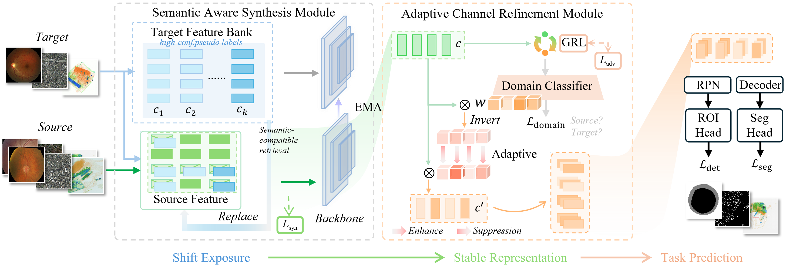

# Eliminating Subtle Shifts for Real-World Industrial Domain Adaptation

**Note:** This repository provides the official implementation of **DAPNet (Domain-Agnostic Purification Network)**, a method designed to address subtle and fine-grained domain shifts commonly found in professional imaging scenarios, such as X-ray security inspection, remote sensing land-cover segmentation, and medical image analysis.



In this paper:

  1） We identify a practical UDA challenge termed ``Small shift, Large gap”, where subtle hardware-induced variations in specialized imaging systems, though barely perceptible in image space, lead to significant feature distribution gaps and degrade cross-domain performance.
  
  2） We propose DAPNet, a domain-agnostic purification framework that addresses subtle domain shift through a synergistic ``expose-then-refine” mechanism: SASM exposes latent domain bias as learnable cross-domain contrastive signals through semantically constrained cross domain feature synthesis, while ACRM leverages the resulting domain feedback to estimate channel-level stability and refine domain-stable semantic representations.
  
 3）Extensive experiments across multiple scenarios, including **X-ray security inspection**, **medical segmentation**, and **remote sensing analysis**, demonstrate that DAPNet outperforms other UDA methods under challenging subtle domain shift scenarios.


---

## Installation

```bash
cd DAPNet
conda create --name dapnet python=3.8 -y
conda activate dapnet

pip install torch==1.13.1+cu117 torchvision==0.14.1+cu117 torchaudio==0.13.1 --extra-index-url https://download.pytorch.org/whl/cu117
pip install mmcv==1.7.1 -f https://download.openmmlab.com/mmcv/dist/cu117/torch1.13/index.html
```

---

## Datasets

We provide loaders for major datasets used in the paper:

* **X-ray Detection:**
  [X-ray Detection Dataset](https://github.com/DIG-Beihang/XrayDetection#eds-endogenous-domain-shift)

* **Remote Sensing Segmentation:**
  Datasets including ISPRS Potsdam, ISPRS Vaihingen can be downloaded [here](https://github.com/open-mmlab/mmsegmentation/blob/main/docs/en/user_guides/2_dataset_prepare.md#prepare-datasets).

* **Medical Imaging:**
  [Medical Imaging Dataset](https://drive.google.com/file/d/1p33nsWQaiZMAgsruDoJLyatoq5XAH-TH/view)

---

## Training & Test

### Train DAPNet

```bash
python tools/train.py configs/uda/potsdam_vaihingen_stage1.py --work-dir output/xxx --seed 1337
python tools/train.py configs/uda/potsdam_vaihingen_stage2.py --work-dir output/xxx --seed 1337
```

### Test

```bash
python tools/test.py configs/uda/test_potsdam_vaihingen.py output/xxx.pth --eval mIoU mF1 --show-dir output/xx
```

---

## Citation

```bibtex
@inproceedings{ma2024constructing,
  title={Constructing and exploring intermediate domains in mixed domain semi-supervised medical image segmentation},
  author={Ma, Qinghe and Zhang, Jian and Qi, Lei and Yu, Qian and Shi, Yinghuan and Gao, Yang},
  booktitle={Proceedings of the IEEE/CVF conference on computer vision and pattern recognition},
  pages={11642--11651},
  year={2024}
}

@inproceedings{he2025differential,
  title={Differential Alignment for Domain Adaptive Object Detection},
  author={He, Xinyu and Li, Xinhui and Guo, Xiaojie},
  booktitle={Proceedings of the AAAI Conference on Artificial Intelligence},
  volume={39},
  number={16},
  pages={17150--17158},
  year={2025}
}

@inproceedings{tao2022exploring,
  title={Exploring endogenous shift for cross-domain detection: A large-scale benchmark and perturbation suppression network},
  author={Tao, Renshuai and Li, Hainan and Wang, Tianbo and Wei, Yanlu and Ding, Yifu and Jin, Bowei and Zhi, Hongping and Liu, Xianglong and Liu, Aishan},
  booktitle={2022 IEEE/CVF conference on computer vision and pattern recognition (CVPR)},
  pages={21157--21167},
  year={2022},
  organization={IEEE}
}

@article{ma2024decomposition,
  title={Decomposition-based unsupervised domain adaptation for remote sensing image semantic segmentation},
  author={Ma, Xianping and Zhang, Xiaokang and Ding, Xingchen and Pun, Man-On and Ma, Siwei},
  journal={IEEE Transactions on Geoscience and Remote Sensing},
  year={2024},
  publisher
```
